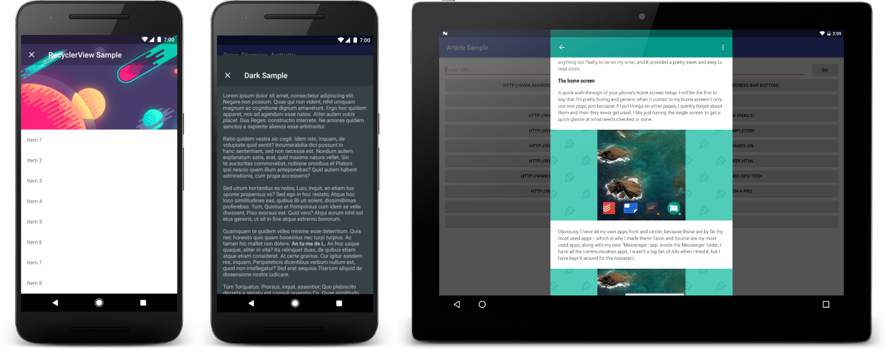

# Android Article Viewer

This library is an attempt to build on top of the concept of Chrome Custom Tabs - taking it one step further and creating a consistent experience for news/article viewing. It's main goal is to detect whether a URL is a link to an article somewhere on the web and if it is, parse that article and display it in a RecyclerView. If it isn't, then open the link in a Chrome Custom Tab instead.

## Including It In Your Project

One of the major goals is to make this as simple as possible to integrate into your new or existing apps when you're already considering (or have implemented) using Custom Tabs for opening links.

In your project's root `build.gradle` (not your module's `build.gradle`):

```groovy
allprojects {
    repositories {
        ...
        jcenter()
        maven { url "https://jitpack.io" }
    }
}
```

To include it in your project, add this to your module's `build.gradle` file:

```groovy
dependencies {
	...
	compile 'com.klinkerapps:article_viewer:0.16.0'
}
```

When using a chrome custom tab, you would create and start the view with code similar to the following:

```java
CustomTabIntent intent = new CustomTabIntent.Builder()
        .setToolbarColor(primaryColor)
        .build();

intent.launchUrl(this, Uri.parse(url));
```

My goal was to enable you to simply swap out the `CustomTabIntent` class for `ArticleIntent`, meaning the the previous example would be invoked like the following for this library:

<pre lang="java">
<b>ArticleIntent</b> intent = new <b>ArticleIntent</b>.Builder(<b>this</b>, apiKey)
        .setToolbarColor(primaryColor)
        .build();

intent.launchUrl(this, Uri.parse(url));
</pre>

Simple, right? You can pass any parameters into the builder that you would normally use in a custom tab such as colors and toolbar actions (however, many of those actions are not currently supported by this library, though they will be displayed if the library ends up opening a custom tab instead of displaying the article natively). I also added on a few extras to the builder that you can use to customize the UI more to your liking:

<pre lang="java">
ArticleIntent intent = new ArticleIntent.Builder(this, apiKey)
        .setToolbarColor(primaryColor)
        <b>.setAccentColor(accentColor)</b>
        <b>.setTheme(ArticleIntent.THEME_DARK)</b>
        <b>.setTextSize(15)</b>     // 15 SP (default)
        .build();

intent.launchUrl(this, Uri.parse(url));
</pre>

You can check out the sample application for more information and implementation notes.

## Obtaining an API Key

I distribute API keys for free to whoever wants one, I just ask that you give us a contact email address and a short description about how you're planning on using it. You can sign up for one at https://article.klinkerapps.com/developer. After signing up, simply pass it into the article intent builder as seen in the example above.

If you want to try out the sample app, you'll also have to register for an API token. After that, you need to rename the `api_keys.properties.example` file to `api_keys.properties` and it's contents should just be your token: `API_KEY=<your-api-token>`.

## Preloading an Article

You can also preload articles so that when the user wants to see it, it is immediately available for them to view. This would be helpful in the context of a message that they received from a friend that you knew the user was going to open and look at. This is a simple task:

```java
ArticleUtils utils = new ArticleUtils(myApiToken);
utils.preloadArticle(context, url, callback);
```

The callback is optional will be invoked when the article has finished loading and is cached. If you call this multiple times, a network call will only be made the first time. To open an article after it has been preloaded, simply follow the same steps as above with an `ArticleIntent.Builder`.

This API is safe to use on the UI thread. It performs its work in the background and provides a callback for when that work is done.

## Fetching an Article

As opposed to `preloading` an article, you can also `fetch` an article.

The difference between these two methods is that `fetch` is syncronous. You will have to manage the threading yourself, as this method makes a network call directly and must be run on a background thread. Instead of providing a callback for when the article loading is completed, it will return the `Article` object directly.

```java
ArticleUtils utils = new ArticleUtils(myApiToken);
Article article = utils.fetchArticle(context, url);
```

As with `preload`, if you call this multiple times, a network call will only be made the first time. To open an article after it has been `fetched`, simply follow the same steps as above with an `ArticleIntent.Builder`.

## Saving Articles

If you create an app that can save articles for users to be able to view later, you can add this saving functionality to the library. To do this, first request the save permission in your manifest:

```xml
<uses-permission android:name="xyz.klinker.android.article.SAVED_ARTICLE"/>
```

This will cause a star icon to be displayed on the toolbar that a user can use to save or remove the saved item.

Next, register a receiver that will listen for these changes to the article:

```xml
<receiver android:name=".SampleSavedBroadcastReceiver">
    <intent-filter>
        <action android:name="xyz.klinker.android.article.ARTICLE_SAVED"/>
    </intent-filter>
</receiver>
```

This will provide you with the article inside the intent extras. You can grab the actual article object by passing the intent into the constructor:


```java
public class SampleSavedBroadcastReceiver extends BroadcastReceiver {
    @Override
    public void onReceive(Context context, Intent intent) {
        Article article = new Article(intent);
    }
}
```

Then just do whatever you want with the article (probably save a reference of it to your own database and display it somewhere else in your app).

## How It Works

This library leverages a`node.js` backend that I have deployed on AWS that does all of the heavy lifting for processing an article. On the backend, we go and grab the article and strip out anything in it that we don't want as soon as we get a URL from the app. We'll then return the results to the library and cache them in a MongoDB instance so that next time we get a request for the same article, it is significantly faster to load.

## Why Should I Use This?

There are quite a few benefits that I see from using this library over just simple Custom Tabs, but of course there are also some downsides.

Benefits:
* Save user's time and data
 * responses are smaller since all of the extra junk (ads, other articles, etc) is taken out and gzipped
 * can load significanly faster than a full webpage when article is already cached
* Consistent (and beautiful) UI accress all of the articles and websites that you send to it
* Keeps your users inside and enjoying your app instead of sending them elseware to view an article

Downsides:
* When not an article, we still take time to try and process it on the server and return something to the device, so that can be some wasted time that could have been spent going immediately to the Custom Tab instead. After we get a good amount of cached data however, this should be negligable as all of the responses will be immediately from the server and won't require additional processing. You can also eliminate this by preloading articles.
* It's difficult to parse every article out there since every site formats it's data differently. If this is the case, then we'll fall back to opening the article in a Custom Tab immediately, however sometimes it's difficult to recognize on the server whether or not something actually is an article. We're trying to apply machine learning to get better at this.
* You're sending your users to our backend instead of your own. I don't collect any personal data from anything sent to the server, just cache the requested article so there aren't really privacy concerns here that I can see, just something to be aware of.

I personally think that the benefits of a smooth, quick UI outweigh the downsides, especially in apps where a lot of users are sharing links to articles like on Twitter or messaging.

## License

    Copyright 2016 Jake Klinker

    Licensed under the Apache License, Version 2.0 (the "License");
    you may not use this file except in compliance with the License.
    You may obtain a copy of the License at

       http://www.apache.org/licenses/LICENSE-2.0

    Unless required by applicable law or agreed to in writing, software
    distributed under the License is distributed on an "AS IS" BASIS,
    WITHOUT WARRANTIES OR CONDITIONS OF ANY KIND, either express or implied.
    See the License for the specific language governing permissions and
    limitations under the License.
